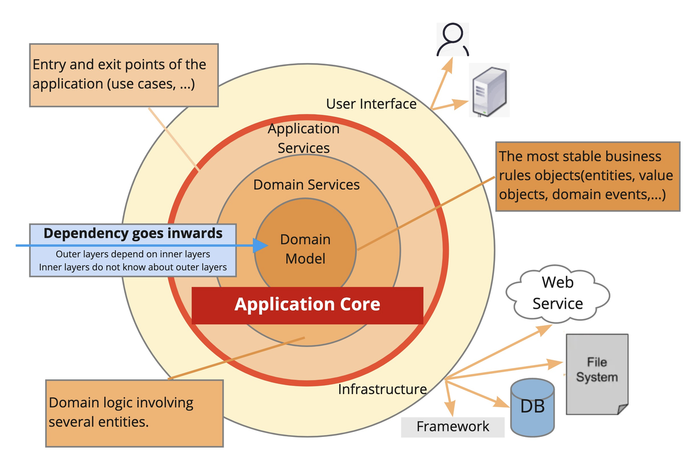

# Go-Zero 洋葱架构模板项目

## 洋葱架构介绍
2008 年 Jeffrey Palermo 提出了洋葱架构(属于应用架构)。通过分离关注点（即：分离业务复杂性与技术复杂性，分离业务不变性与可变性）在其内部构建出稳定、灵活、可演进的模型。具有以下特点：
- 核心模型稳定性高
- 核心模型可测试性高，可达到 100% 测试覆盖率
- 核心模型独立于基础设施，与 DB、Redis、RPC 等无关
  共分为三层，分别是领域层（领域模型和领域服务）、应用服务层、基础设施层。
  外层能依赖内层，内层不能依赖外层，即内层不能感知外层的对象、方法、类等。



## Go-zero+DDD
结合 go-zero 的服务架构和 DDD 思想后，一个较为理想的项目层级设计通常会将代码分为多个独立但协同工作的层次，从上到下大致如下：

- **app/**（应用层）  
负责业务流程的编排、事务控制、DTO 与领域模型之间的转换，以及协调多个领域服务完成复合业务场景。此层不应包含具体的业务规则，只负责调用领域层的接口。
- **domain/**（领域层）  
这是核心层，负责聚焦业务本质。包含领域实体、值对象、领域服务和仓储接口等。领域层的设计需要尽可能纯粹，避免直接依赖具体的基础设施实现。
- **infrastructure/**（基础设施层）  
提供领域层所依赖的具体实现，比如数据库持久化（仓储实现）、缓存、消息队列、第三方 API 调用等。通过依赖倒置，领域层只依赖于接口，而具体实现由基础设施层提供。
- **svc/**  
存放服务上下文（Service Context），通常包括配置、依赖注入的初始化逻辑等，方便在整个服务中共享和传递。

这种层次划分既符合 go-zero 对项目工程化的要求，也充分体现了 DDD 的高内聚低耦合原则，能使服务在面对复杂业务时保持清晰的边界和良好的可维护性。

项目目录结构参考：

```aidl
user
├── README.md
├── etc             // 存放运行时静态配置文件
│   └── user.yaml
├── go.mod
├── go.sum
├── internal        // 微服务内部可见的文件夹
│   ├── app                     // DDD【应用层】：负责业务流程编排
│   │   └── user_service.go
│   ├── domain                  // DDD【领域层】：包含实体、领域服务和仓储接口
│   │   ├── entity              // 实体对象和领域事件
│   │   │   ├── user.go
│   │   │   └── user_registerd_event.go
│   │   ├── repository          // 存放仓储接口，具体实现在仓储层
│   │   │   ├── event_repository.go
│   │   │   └── user_repository.go
│   │   └── service             // 领域服务，处理业务规则，领域知识
│   │       └── user_domain_service.go
│   ├── infrastructure          // DDD【基础设施层】：实现仓储接口（此处以 MySQL 为例）、接口接入、外部接口实现
│   │   ├── config              // 配置定义用来绑定配置文件
│   │   │   └── config.go
│   │   ├── controller          // http/rpc 接口入口
│   │   │   ├── http
│   │   │   └── rpc
│   │   │       └── user_server.go
│   │   ├── repository          // 仓储实现
│   │   │   ├── event           // 领域事件仓储
│   │   │   │   ├── event.sql
│   │   │   │   ├── eventmodel.go
│   │   │   │   ├── eventmodel_gen.go
│   │   │   │   └── vars.go
│   │   │   └── user            // 用户仓储
│   │   │       ├── user.sql
│   │   │       ├── usermodel.go
│   │   │       ├── usermodel_gen.go
│   │   │       └── vars.go
│   │   └── serviceimpl         // 外部接口实现
│   └── svc
│       └── service_context.go  // 依赖管理：服务上下文，初始化各项依赖
└── user.go                     // 服务启动入口
```


这种项目层级设计既可以利用 go-zero 框架的高性能和工程化能力，又能让我们以领域驱动设计（DDD）的方式构建清晰、解耦且易于演进的微服务架构。